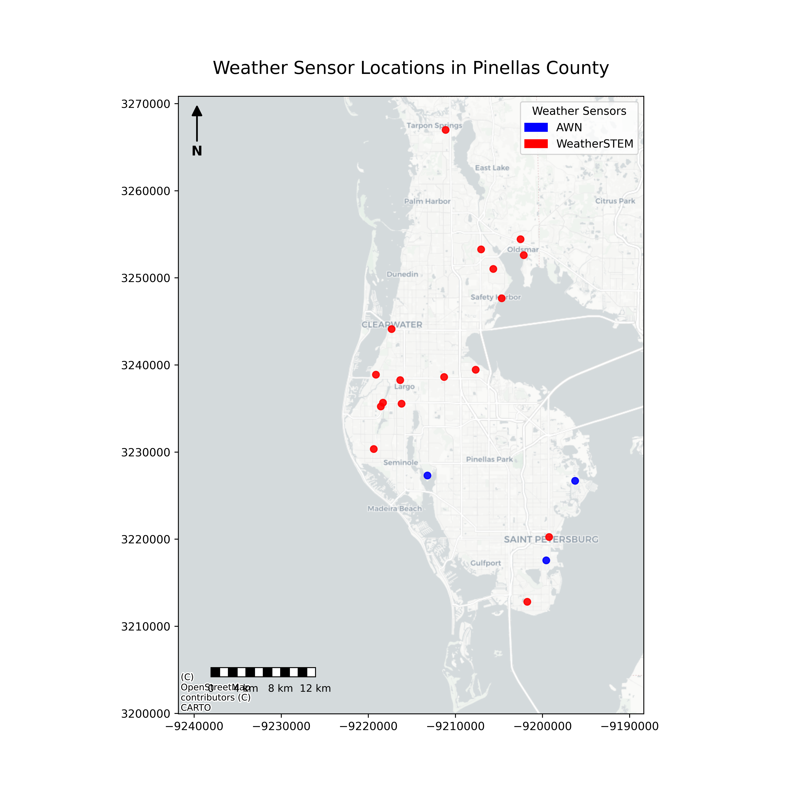

<h1 align="center">Urban Flood Prediction</h1>

<h2 align="center">Table of Contents</h2>

<ol class="toc" role="list">
    <li>
      <a href="#Abstract">
        Abstract
      </a>
    </li>
    <li>
      <a href="#List of Tables">
        List of Tables
      </a>
    </li>
    <li>
      <a href="#List of Figures">
        List of Figures
      </a>
    </li>
    <li>
      <a href="#Introduction">
        Introduction
      </a>
    </li>
    <li>
      <a href="#Methods">
        Methods
      </a>
    </li>
    <ol class="toc" role="list">
      <li>
        <a href="#Study Area">
          Study Area
        </a>
      </li>
      <li>
        <a href="#Data Sources and Processing">
          Data Sources and Processing
        </a>
      </li>
      <li>
        <a href="#Flooding Inventory Data">
          Flooding Inventory Data
        </a>
      </li>
    </ol>
    <li>
      <a href="#Results">
        Results
      </a>
    </li>
    <li>
      <a href="#Discussion">
        Discussion
      </a>
    </li>
    <li>
      <a href="#Conclusion">
        Conclusion
      </a>
    </li>
    <li>
      <a href="#Acknowledgments">
        Acknowledgments
      </a>
    </li>
    <li>
      <a href="#Data Access">
        Data Access
      </a>
    </li>
    <li>
      <a href="#References">
        References
      </a>
    </li>
</ol>

<h2 id = "Abstract">Abstract</h2>

&nbsp;&nbsp;&nbsp;&nbsp;&nbsp;&nbsp;&nbsp;Lorem Ipsum

<h2 id = "List of Tables">List of Tables</h2>
<ol>
    <li>
      <a href="#Table 1">
        Table 1. Data Inputs
      </a>
    </li>
</ol>

&nbsp;&nbsp;&nbsp;&nbsp;&nbsp;&nbsp;&nbsp;Lorem Ipsum

<h2 id = "List of Figures">List of Figures</h2>
<ol>
    <li>
      <a href="#Figure 1">
        Figure 1: Weather Sensor Locations in Pinellas County
      </a>
    </li>
</ol>

<h2 id = "Introduction">Introduction</h2>

&nbsp;&nbsp;&nbsp;&nbsp;&nbsp;&nbsp;&nbsp;Lorem Ipsum

<h2 id = "Methods">Methods</h2>

<h3 id = "Data Sources and Processing">Data Sources and Processing</h3>

&nbsp;&nbsp;&nbsp;&nbsp;&nbsp;&nbsp;&nbsp; The inputs into the CNN from various flood drivers and it's sources are listed in <a href="#Table 1">Table 1</a>.

<table id = "Table 1">
  <caption>Table 1. Data Inputs</caption>
  <thead>
    <tr>
      <th>Data</th>
      <th>Format</th>
      <th>Resolution</th>
      <th>Period</th>
      <th>Source</th>
      <th>Notes</th>
    </tr>
  </thead>
  <tbody>
    <tr>
      <td>LiDAR</td>
      <td>LiDAR Point Cloud (LPC)</td>
      <td>nominal point spacing: 0.35 m</td>
      <td>2018</td>
      <td><a href="https://rockyweb.usgs.gov/vdelivery/Datasets/Staged/Elevation/LPC/Projects/FL_Peninsular_2018_D18/FL_Peninsular_Pinellas_2018/LAZ/" target="_blank">USGS</a></td>
      <td><a href="https://github.com/colarussoa/urban_flood_prediction/blob/main/Data/download%20LAS%20files.ipynb" target="_blank">See download LAS files.ipynb</a> Note: a DSM will be generated from the LAS following this procedure: <b>link to code snippet</b>; this product will also be used to create the building footprints</td>
    </tr>
    <tr>
      <td>FDOT Aerial Imageries (w/ CIR band)</td>
      <td>Raster</td>
      <td>0.62 ft <b>Need to get meter conversion</b></td>
      <td>2023; <b>We could get 2024 data was recently made available, still not allowed 2025 according to the website</b></td>
      <td><a href="https://rockyweb.usgs.gov/vdelivery/Datasets/Staged/Elevation/LPC/Projects/FL_Peninsular_2018_D18/FL_Peninsular_Pinellas_2018/LAZ/" target="_blank">USGS</a></td>
      <td><a href="https://aplus.fdot.gov/" target="_blank">Available for request through the FDOT</a></td>
    </tr>
  </tbody>
  <tfoot>
    <tr>
      <td>Landcover</td>
      <td>Raster</td>
      <td>30 m</td>
      <td>2024</td>
      <td><a href="https://www.usgs.gov/centers/eros/science/annual-nlcd-data-access" target="_blank">USGS NLCD</a></td>
      <td><a href="https://github.com/colarussoa/urban_flood_prediction/blob/main/Notebooks/landcover_request.ipynb">Data request via WMS Notebook </a>. This parameter can be inverted to increase accuracy. There's an associated confidence; There is also <a href="https://esa-worldcover.org/en/data-access">ESA</a> or <a href="https://dynamicworld.app/">dynamic world data</a> that has a 10 meter resolution and is also an AI-generated product like the USGS</td>
    </tr>
    <tr>
      <td>Landcover: this LULC data makes more sense to use</td>
      <td>Raster</td>
      <td>10 m</td>
      <td>2024</td>
      <td><a href="https://gis.myfwc.com/data/zips/custom/CLC/CLC_Raster.zip" target="_blank">FWC Cooperative Land Cover, Version 3.8</a></td>
      <td><a href="https://github.com/colarussoa/urban_flood_prediction/blob/main/Notebooks/landcover_request.ipynb">Data request via Notebook</a>.</td>
    </tr>
    <tr>
      <td>Highwater Mark Data</td>
      <td>point</td>
      <td>peak flood condition</td>
      <td>2024</td>
      <td>Pinellas County</td>
      <td>Data is confidential; </td>
    </tr>
    <tr>
      <td>Camera Network: flood monioring data</td>
      <td>point</td>
      <td>15 min</td>
      <td>2024</td>
      <td>USF</td>
      <td>Don't know where the classified data is; Sofi maybe, need to send email</td>
    </tr>
    <tr>
      <td>FDOT Aerial Imageries (w/ CIR band)</td>
      <td>Raster</td>
      <td>unk, I think 0.5 m</td>
      <td>2023</td>
      <td><a href="https://rockyweb.usgs.gov/vdelivery/Datasets/Staged/Elevation/LPC/Projects/FL_Peninsular_2018_D18/FL_Peninsular_Pinellas_2018/LAZ/" target="_blank">USGS</a></td>
      <td><a href="https://github.com/colarussoa/urban_flood_prediction/blob/main/Data/download%20LAS%20files.ipynb" target="_blank">See download LAS files.ipynb</a></td>
    </tr>
  </tfoot>
</table>

<table id = "Table 2">
  <caption>Table 2. Derived Data from Inputs</caption>
  <thead>
    <tr>
      <th>Data</th>
      <th>Format</th>
      <th>Resolution</th>
      <th>Period</th>
      <th>Source</th>
      <th>Notes</th>
    </tr>
  </thead>
  <tbody>
    <tr>
      <td>LiDAR</td>
      <td>LiDAR Point Cloud (LPC)</td>
      <td>nominal point spacing: 0.35 m</td>
      <td>2018</td>
      <td><a href="https://rockyweb.usgs.gov/vdelivery/Datasets/Staged/Elevation/LPC/Projects/FL_Peninsular_2018_D18/FL_Peninsular_Pinellas_2018/LAZ/" target="_blank">USGS</a></td>
      <td><a href="https://github.com/colarussoa/urban_flood_prediction/blob/main/Data/download%20LAS%20files.ipynb" target="_blank">See download LAS files.ipynb</a> Note: a DSM will be generated from the LAS following this procedure: <b>link to code snippet</b>; this product will also be used to create the building footprints</td>
    </tr>
  </tfoot>
</table>

&nbsp;&nbsp;&nbsp;&nbsp;&nbsp;&nbsp;&nbsp;Rainfall data was collected by a sensor network installed by USF using the Ambient Weather Network (AWN) and open-source data from WeatherSTEM <a href="#Figure 1">Figure 1</a>.

<figure>
    
    <figcaption>Figure 1: WeatherSTEM and Ambient Weather Network (AWN) Weather Sensor Locations in Pinellas County<b>Add axis labels, northing and easting</b></figcaption>
</figure>

<h2 id = "Results">Results</h2>

&nbsp;&nbsp;&nbsp;&nbsp;&nbsp;&nbsp;&nbsp;Lorem Ipsum

<h2 id = "Discussion">Discussion</h2>

&nbsp;&nbsp;&nbsp;&nbsp;&nbsp;&nbsp;&nbsp;Lorem Ipsum

<h2 id = "Conclusion">Conclusion</h2>

&nbsp;&nbsp;&nbsp;&nbsp;&nbsp;&nbsp;&nbsp;Lorem Ipsum

<h2 id = "Conclusion">Conclusion</h2>

&nbsp;&nbsp;&nbsp;&nbsp;&nbsp;&nbsp;&nbsp;Lorem Ipsum

<h2 id = "Data Access">Data Access</h2>

&nbsp;&nbsp;&nbsp;&nbsp;&nbsp;&nbsp;&nbsp;Data is stored <a href="https://github.com/colarussoa/urban_flood_prediction/tree/main/Data">in this GitHub Repository</a> or through <a href="https://usf.app.box.com/folder/337637864831">Box</a>. Information on how to download the data thorugh APIs, WMS, and Endpoints is available under <a>Notebooks/Download_Data in this Github repository</a>

<h2 id = "References">References</h2>

&nbsp;&nbsp;&nbsp;&nbsp;&nbsp;&nbsp;&nbsp;Lorem Ipsum

